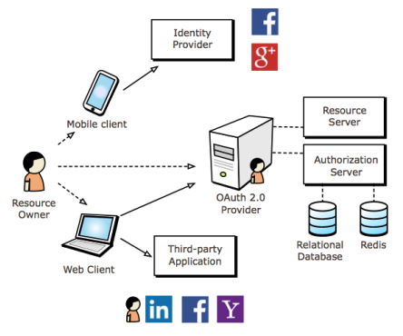
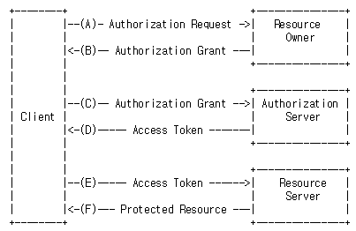

# Open standard for access delegation (OAuth)

[TOC]

## OAuth
> - Client(웹, 앱)에서 안전하고 표준화된 방법으로 안전하게 인증할 수 있는 개방형 프로토콜
> - OpenID로 개발된 표준 인증 방식
> - OAuth란 Resource Owner(유저)가 리소스(아이디, 비밀번호 등)를 제공하지 않고 다른 앱, 웹의 자신의 정보에 대해 웹사이트나 앱의 접근 권한을 부여할 수 있는 공통적인 수단으로서 사용되는, 접근 위임을 위한 개방형 표준

## OAuth의 네 가지 주요 구성 요소
> - **Resource Owner:** 인증서버(Authorization Server)에 계정을 가지고 있는 개인.
>   나의 리소스를 사용할 수 있게 Client에 권한을 위임하는 사용자.
> - **Client:** OAuth를 사용해서 리소스 오너를 대신해 API 서버(Resource Server)에 접근하는 웹사이트나 애플리케이션.
> - **Resource Server:** OAuth를 통해서 접근을 허용하는 웹 애플리케이션 및 Open API 등의 자원.
> - **Authorization Server:** 인증 역할을 하는 서버.
>
> OAuth 2.0으로 보호되는 어플리케이션 용어를 단순화시키기 위해 인가서버와 리소스 서버의 조합을 OAuth 2.0 프로바이더라고 함.
>
## 주요 용어

>- App secret: OAuth 2.0 Provider가 Client를 인증하기 위한 키
>- Request token: Resource Owner가 사용자에게 접근권한을 인증받기 위해 필요한 정보가 담겨있으며 후에 접근 토큰으로 변환된다.
>- Access token: 인증 후에 Resource Owner가 OAuth 2.0 Provider가 아닌 Client를 통해서 보호된 자원에 접근하기 위한 키를 포함한 값.

## access token
> 1. Client가 Resource Owner의 정보(ID/PW)를 가지지 않고 API를 사용할 수 있음
> 2. 필요한 API에만 제한적으로 접근할 수 있도록 권한 제어 가능
> 3. Resource Owner가 OAuth 2.0 Provider의 관리 페이지에서 권한 취소 가능
> 4. 패스워드 변경 시에도 인증 토큰은 계속 유효함.

## OAuth 인증과정

> 1. 인증되지 않은 Resource Owner가 Client의 웹페이지에 접근한다.
> 2. Client는 인증되지 않은 Resource Owner에게 OAuth 2.0 Provider(구글 등)에게 인증을 받아 오라고(access token을 가지고 오라고) 하고 링크한다.
> 3. Resource Owner가 OAuth 2.0 Provider(구글))에서 인증을 하고 돌아온다.
> 4. OAuth 2.0 Provider(구글)는 인증코드를 Client에 전달한다.
> 5. Client는 OAuth 2.0 Provider에서 받은 Client ID, Client Secret, 전달받은 인증코드를 OAuth 2.0 Provider(구글)에 보낸다.
> 6. OAuth 2.0 Provider(구글)는 Client의 요청을 검증하고 Access token을 발급한다.
> 7. 발급한 access token을 통해 Client는 Resource Owner의 정보에 접근하고 웹페이지 접근을 허가한다.

## OAuth 2.0 변경 사항
- Siganature 단순화 정렬과 URL 인코딩이 필요 없다.(직관적인 개발/문서화 가능, API 테스트 간단)
- 암호화가 필요 없음 HTTPS를 사용하고 HMAC을 사용하지 않음(여러 가지 인증 방식 지원을 통해 웹 애플리케이션이 아닌 애플리케이션 지원 강화)
- Refresh Token(Access Token 갱신)

> https://d2.naver.com/helloworld/24942
> https://earlybird.kr/1584
